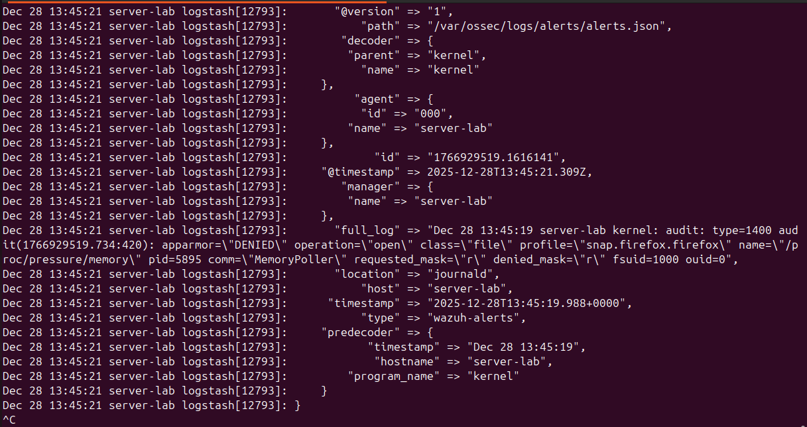
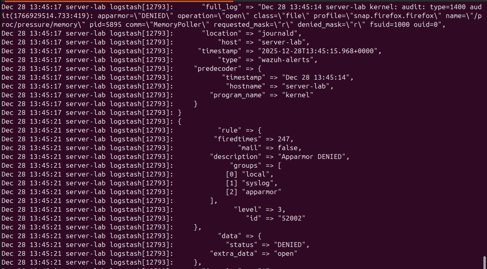
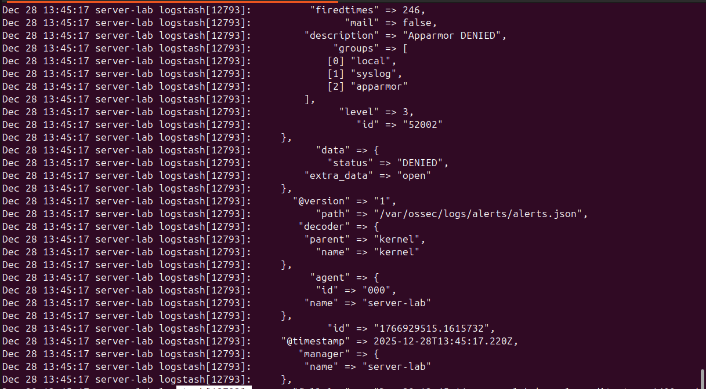
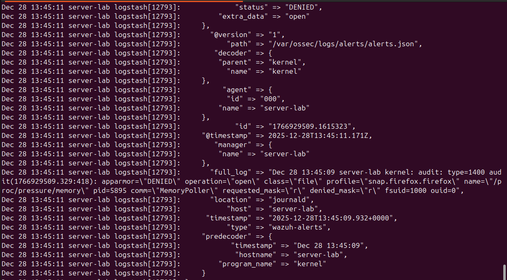
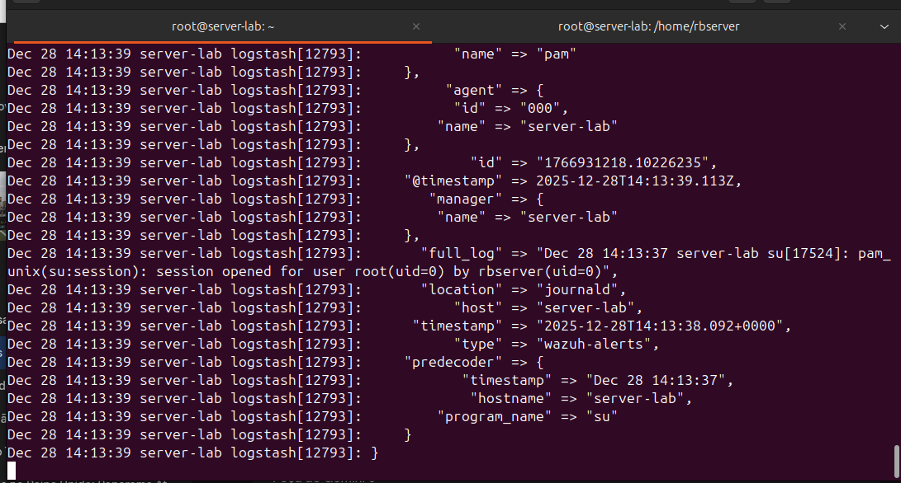
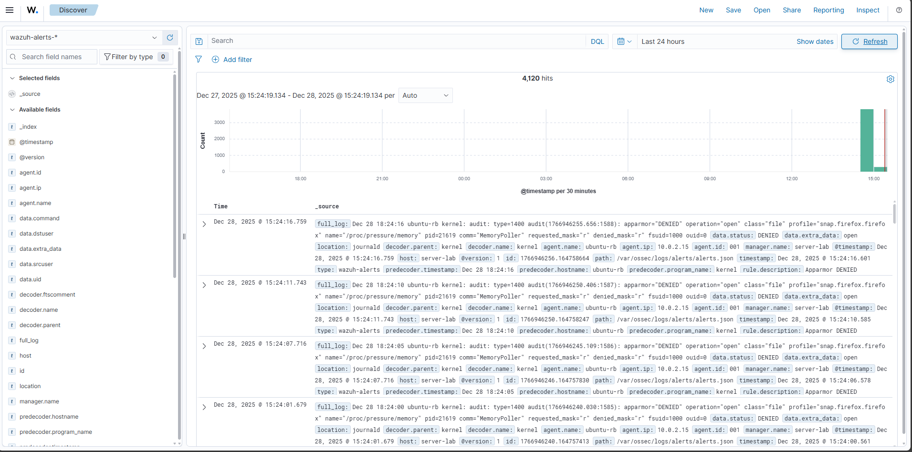

# my-soc-lab
Laboratório de SOC para monitoramento e análise de incidentes utilizando Wazuh SIEM e Logstash para normalização de telemetria e detecção de ameaças em tempo real.

🛡️ SIEM Lab: Pipeline de Detecção e Visibilidade (Wazuh + Logstash)
📝 Descrição
Este projeto demonstra a implementação de um ambiente de monitoramento de segurança escalável, utilizando o Wazuh como motor de detecção e o Logstash como motor de ingestão e tratamento de dados. O laboratório foi projetado para simular o fluxo real de uma operação de SOC, desde a geração do log bruto no kernel até a normalização do alerta para análise.

🛠️ Tecnologias e Ferramentas
Wazuh SIEM: Detecção de intrusão, monitoramento de integridade e análise de logs.

Logstash (Elastic Stack): Processamento e normalização de telemetria.

Linux (Ubuntu/Server): Sistema operacional host do laboratório.

AppArmor: Módulo de segurança do kernel monitorado.

🚀 Arquitetura do Pipeline
Geração de Evento: O Kernel/AppArmor detecta uma violação de política.

Coleta: O Wazuh Manager monitora os logs do sistema e grava alertas em alerts.json.

Ingestão: O Logstash lê o arquivo JSON em tempo real.

Normalização: O dado é estruturado em campos (JSON) para facilitar a busca e correlação.

🔍 Evidência de Funcionamento
Nas imagens abaixo, é possível observar o pipeline em ação, capturando violações de segurança reais (AppArmor DENIED) processadas pelo Logstash em tempo real:

> **Nota:** Os logs demonstram a regra 52002 (Nível 3) sendo disparada, fornecendo detalhes críticos para investigação como PID, comando (comm) e o recurso negado..

⚙️ Implementação Técnica
Durante o projeto, realizei as seguintes tarefas críticas:

Tuning de JVM: Ajuste de parâmetros de memória (Xms256m/Xmx256m) no Logstash para otimização de recursos em ambiente virtualizado.

Gestão de Permissões: Configuração de ACLs e grupos (usermod -aG wazuh logstash) para garantir a integridade da leitura dos logs de segurança.

Troubleshooting de Conectividade: Validação de portas de rede (netstat/ss) e testes de ingestão manual via netcat.

Desenvolvimento de Pipeline: Criação de arquivos de configuração .conf para roteamento de dados via TCP e File Input.

Compatibilidade de Ecossistema (Elastic vs OpenSearch): Resolução de travas de versão através da instalação e configuração do plugin logstash-output-opensearch, garantindo a comunicação entre o Logstash 7.17 e o Wazuh Indexer.

### 🛡️ Engenharia de Detecção: Escalação de Privilégios
Para validar a capacidade de resposta a incidentes críticos, configurei uma regra personalizada para detectar o uso do comando `sudo su`.

> **Análise do Alerta:** O log acima demonstra a detecção em tempo real de uma sessão root sendo aberta. Este tipo de monitoramento é vital para identificar possíveis movimentações laterais ou uso indevido de privilégios administrativos.
> Regra Customizada (ID 100002): Implementação de lógica via Regex no local_rules.xml para capturar o evento específico de session opened for user root. Isso eleva a telemetria básica para um alerta crítico de Nível 10.

💡 Aprendizados
Este projeto reforçou minha capacidade de depurar falhas de ingestão de dados e entender como os metadados (timestamp, host, rule_id) são fundamentais para a triagem de incidentes em um ambiente de SOC profissional.

## 🛠️ Fase 2: Otimização de Pipeline e Engenharia de Detecção

Após a implementação inicial, o projeto evoluiu para resolver desafios críticos de infraestrutura e criar inteligência de detecção personalizada.

### 🧠 Engenharia de Detecção: Escalação de Privilégios
Para validar a capacidade de resposta a incidentes, configurei uma regra personalizada para detectar o uso do comando `sudo su -`.
* **Regra ID**: `100002` (Nível 10 - Crítico).
* **Lógica**: Captura do evento `session opened for user root` via Regex no arquivo `local_rules.xml`.

### ⚙️ Desafios Técnicos e Troubleshooting (Diferencial)
Durante esta fase, realizei tarefas de alta complexidade para estabilizar o ambiente:

* **Tuning de JVM (Java Heap Space)**: O Logstash apresentava falhas de interrupção (`SystemExit`) por falta de memória. Ajustei os parâmetros em `jvm.options` de 256MB para **512MB/1GB**, garantindo estabilidade no processamento.
* **Resolução de Compatibilidade (Logstash vs Wazuh Indexer)**: Identifiquei uma trava de versão entre o Logstash 7.17 e o Indexer. 
* **Solução**: Migrei o pipeline de saída para o plugin **`logstash-output-opensearch`**, eliminando erros de conexão e permitindo o fluxo de dados.

### 📊 Evidência de Funcionamento Final
O dashboard abaixo demonstra o pipeline em plena operação, processando milhares de eventos de telemetria após as correções de infraestrutura:

> **Legenda**: Visualização do Discover com 4,120 hits, confirmando a ingestão de dados estruturados e a resolução dos gargalos de memória.

### 📂 Arquivos de Configuração
Os arquivos técnicos utilizados neste laboratório podem ser encontrados nos links abaixo:
* [Regras Customizadas (local_rules.xml)](./rules/local_rules.xml)
* [Pipeline do Logstash (soc-logs.conf)](pipelines/soc-logs.conf)

### 💡 Aprendizados Avançados
Este projeto reforçou minha capacidade de depurar falhas de ingestão em sistemas complexos e entender como o ajuste de parâmetros de baixo nível (como memória de heap e plugins de saída) é vital para a sustentação de um SOC profissional.

## 🏁 Conclusão e Visão de Futuro

O sucesso deste projeto demonstrou que a eficácia de uma operação de SOC não depende apenas de regras de detecção bem escritas, mas de um pipeline de dados resiliente e escalável. A capacidade de depurar desde o consumo de memória de baixo nível da JVM até a compatibilidade de protocolos entre ecossistemas (Elastic vs. OpenSearch) foi o diferencial que permitiu transformar telemetria bruta em inteligência acionável no Dashboard.

### 🚀 Próximos Passos
Para elevar ainda mais a maturidade deste laboratório, planejo as seguintes implementações:
* **Automação de Resposta (SOAR)**: Integrar o Wazuh com ferramentas de resposta ativa para bloquear automaticamente IPs que disparem alertas de força bruta.
* **Enriquecimento de Dados**: Implementar GeoIP e Threat Intelligence (MISP) para contextualizar a origem e a periculosidade dos alertas capturados.
* **Visualização Avançada**: Criar dashboards personalizados no Grafana para métricas de performance e tendências de segurança a longo prazo.

Este laboratório reflete minha dedicação em dominar o ciclo completo da cibersegurança: da infraestrutura à engenharia de detecção.
